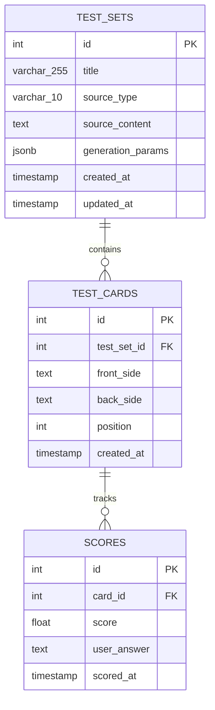

# Flashcard Generator

A learning app that generates mnemotechnic flashcards from any uploaded text.

**Features:**

- Upload text or a URL; in the latter case, extract the page's contents.
- AI-generated mnemotechnic flashcards to study; each flashcard must not have more than 50 words.

## Setup

### Prerequisites

- Python 3.11+
- PostgreSQL 15+

### Installation

```bash
# Clone repository
git clone https://github.com/LevkoBe/flashcard-generator.git
cd flashcard-generator

# Create virtual environment
python -m venv venv
source venv/bin/activate  # Windows: venv\Scripts\activate

# Install dependencies
pip install -r requirements.txt

# Configure environment (.env file)
```

### Database Setup

```bash
# Create database
createdb flashcard_generator

# Run migrations
alembic upgrade head
```

### Run Tests

```bash
pytest tests/ -v
```

### Lint Code

```bash
flake8 app/ tests/
```

## Project Structure

```
flashcard-generator/
├── app/
│   ├── models/         # SQLAlchemy database models
│   ├── schemas/        # Pydantic validation schemas
│   ├── api/            # FastAPI route handlers
│   ├── services/       # Business logic
│   └── utils/          # Helper functions
├── tests/              # Tests
├── alembic/            # Database migrations
├── docs/               # Design and sketches
└── .github/workflows/  # CI/CD configuration
```

## Entity Relationship Diagram


