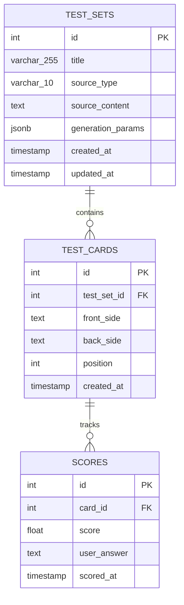

# Flashcard Generator

A learning app that generates mnemotechnic flashcards from any uploaded text.

**Navigation**
- [Introduction](#flashcard-generator)
- [Features](#features)
- [Setup](#setup)
  - [Prerequisites](#prerequisites)
  - [Installation](#installation)
  - [Database Setup](#database-setup)
  - [Run Application](#run-application)
  - [Run Tests](#run-tests)
  - [Lint Code](#lint-code)
- [Usage](#usage)
- [API Endpoints](#api-endpoints)
- [Project Structure](#project-structure)
- [Entity Relationship Diagram](#entity-relationship-diagram)
- [Technology Stack](#technology-stack)

## Features

- Upload text or a URL; in the latter case, extract the page's contents
- AI-generated mnemotechnic flashcards to study; each flashcard must not have more than 50 words
- Test yourself with fuzzy-match scoring that accepts similar answers
- Track your performance with score history

## Setup

### Prerequisites

- Python 3.11+
- PostgreSQL 15+

### Installation

```bash
# Clone repository
git clone https://github.com/LevkoBe/flashcard-generator.git
cd flashcard-generator

# Create virtual environment
python -m venv venv
source venv/bin/activate  # Windows: venv\Scripts\activate

# Install dependencies
pip install -r requirements.txt

# Configure environment (.env file)
```

### Database Setup

```bash
# Create database
psql -U postgres -c "CREATE DATABASE flashcard_generator;"

# Run migrations
alembic upgrade head
```

### Run Application

```bash
# Start FastAPI server
uvicorn app.main:app --reload

# Access web interface
# Open browser to http://localhost:8000
```

### Run Tests

```bash
pytest tests/ -v
```

### Lint Code

```bash
flake8 app/ tests/
```

## Usage

1. **Create Test Set:** Upload text or URL on the home page
2. **View Cards:** Browse generated flashcards in the test set
3. **Test Yourself:** Click "Test" to practice with scoring

## API Endpoints

- `POST /api/testset/` - Create test set from text/URL
- `GET /api/testset/` - List all test sets
- `GET /api/testset/{id}` - Get specific test set with cards
- `PUT /api/testset/{id}` - Update test set title
- `DELETE /api/testset/{id}` - Delete test set
- `POST /api/testset/{id}/testcard/` - Add card manually
- `GET /api/testset/{id}/testcard/` - List cards in set
- `PUT /api/testset/{id}/testcard/{card_id}` - Edit card
- `DELETE /api/testset/{id}/testcard/{card_id}` - Delete card
- `POST /api/testset/{id}/testcard/{card_id}/score` - Submit answer for scoring

## Project Structure

```
flashcard-generator/
├── app/
│   ├── models/         # SQLAlchemy database models
│   ├── schemas/        # Pydantic validation schemas
│   ├── api/            # FastAPI route handlers
│   ├── services/       # Business logic (AI, scoring, extraction)
│   ├── static/         # Frontend HTML/CSS/JS
│   └── utils/          # Helper functions
├── tests/              # Tests
├── alembic/            # Database migrations
├── docs/               # Design and sketches
└── .github/workflows/  # CI/CD configuration
```

## Entity Relationship Diagram



## Technology Stack

- **Backend:** FastAPI, SQLAlchemy, PostgreSQL
- **AI:** Google Gemini 2.0 Flash
- **Scoring:** RapidFuzz (fuzzy string matching)
- **Text Extraction:** Trafilatura
- **Frontend:** Vanilla JavaScript, HTML5, CSS3
